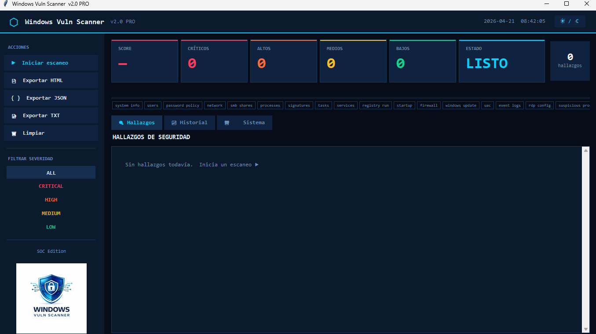
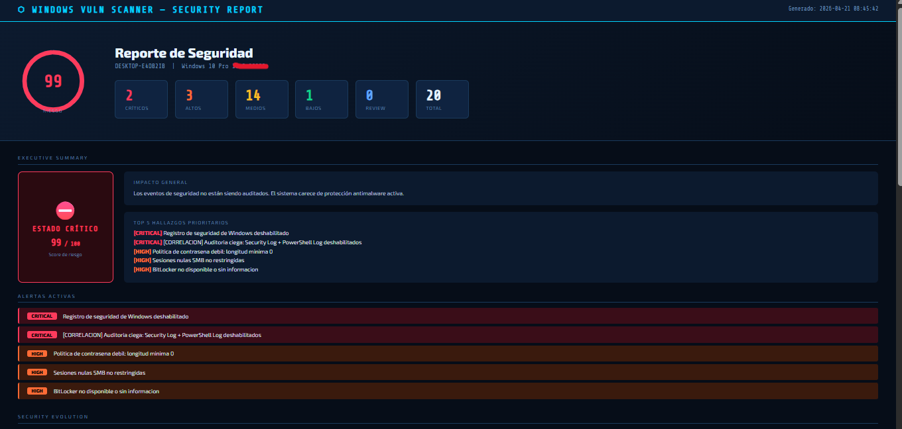
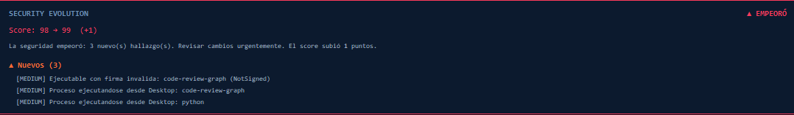

# Windows Vuln Scanner v1.1

> Herramienta de auditoría de seguridad para Windows. Escanea el sistema en busca de vulnerabilidades, malas configuraciones y amenazas activas, genera reportes HTML/JSON/TXT y compara la evolución de seguridad entre escaneos.

  

---

## Descarga rápida

**[⬇ Descargar Portable v1.1](https://github.com/laparatuya2230-cloud/windows-security-analyzer-soc/releases/tag/v1.1)**

Descomprime el ZIP y ejecuta `WinVulnScanner.exe` como **Administrador**.

---

## Capturas de pantalla

### Dashboard principal


### Reporte HTML — Executive Summary, alertas y Security Evolution


### Security Evolution en la UI (comparativa entre escaneos)


---

## Características

- **Dashboard SOC** — Score de riesgo logarítmico, métricas por severidad y gráfico donut en tiempo real
- **21 módulos de escaneo** — cobertura completa de sistema, red, autenticación, logs y amenazas activas
- **Executive Summary** — resumen ejecutivo con estado de riesgo, narrativa de impacto y top hallazgos críticos
- **Sistema de alertas de correlación** — 7 reglas que detectan combinaciones peligrosas de hallazgos (p. ej. fuerza bruta + sin lockout, auto-login + sin BitLocker)
- **Security Evolution** — timeline que compara escaneos consecutivos: hallazgos nuevos, resueltos, empeorados y mejorados, con delta de score y narrativa automática
- **Detección de amenazas activas en Event Logs** — fuerza bruta (ventana 1h), password spray, escalada de privilegios, logins fuera de horario, sesiones RDP remotas
- **Análisis de PowerShell Script Block Logging** — detecta IEX, DownloadString, Base64, WebClient en logs del sistema
- **Estado de Windows Defender** — servicio, protección en tiempo real, edad de firmas, exclusiones sospechosas
- **BitLocker** — estado de cifrado por volumen
- **Auto-login** — detecta credenciales en texto plano en el registro
- **RDP / NTLM / WDigest** — nivel de autenticación, NLA, Credential Guard
- **Detección de procesos sospechosos** — ejecutables desde Temp, Roaming, Downloads, Desktop, Public
- **Detección de LOLBins** — binarios legítimos usados fuera de rutas del sistema
- **Verificación de firmas digitales** — ejecutables sin firma en rutas no estándar
- **MITRE ATT&CK** — cada hallazgo incluye su técnica asociada
- **Exportación de reportes** — HTML, JSON y TXT con Executive Summary, alertas y Security Evolution
- **Historial de escaneos** — deduplicación por ID estable (MD5 de severidad + título normalizado), máx. 50 entradas
- **Temas dark / light**
- **Escaneo automático programado** — cada 30 min, 1 hora o 6 horas
- **UI responsive** — se adapta a cualquier tamaño de ventana

---

## Módulos de detección

| Módulo | Qué detecta |
|---|---|
| `system_info` | Info del sistema operativo y hardware |
| `users` | Cuentas sin contraseña requerida, invitado habilitado |
| `password_policy` | Longitud mínima, historial, bloqueo de cuenta |
| `network` | Puertos expuestos (RPC, SMB, RDP, WinRM…) |
| `smb` | Sesiones nulas, SMBv1 habilitado |
| `processes` | LOLBins activos fuera de rutas del sistema |
| `suspicious_processes` | Procesos desde Temp, Roaming, Downloads, Desktop, Public |
| `signatures` | Ejecutables sin firma en rutas no estándar |
| `firewall` | Firewall deshabilitado por perfil |
| `registry_run` | Entradas sospechosas en Run/RunOnce |
| `startup` | Programas de inicio no reconocidos |
| `scheduled_tasks` | Tareas programadas sospechosas |
| `services` | Servicios con rutas no firmadas o rutas con espacios |
| `windows_update` | Actualizaciones pendientes |
| `event_logs` | Fuerza bruta, spray, escalada de privilegios, logins fuera de horario, RDP remoto |
| `rdp_config` | RDP habilitado, NLA, nivel NTLM, WDigest, Credential Guard |
| `autologin` | Credenciales de auto-login en texto plano en el registro |
| `bitlocker` | Estado de cifrado por volumen |
| `powershell_logs` | Comandos sospechosos en Script Block Logging (ID 4104) |
| `defender` | Estado de Defender, edad de firmas, exclusiones sospechosas |
| `uac` | UAC deshabilitado o nivel reducido |

---

## Alertas de correlación (Behavioral Alerts)

El motor de correlación detecta combinaciones de riesgos que individualmente parecen moderados pero juntos representan una amenaza grave:

| Alerta | Condición |
|---|---|
| Ataque de fuerza bruta activo + sin lockout | >10 intentos fallidos en 1h + política de bloqueo deshabilitada |
| Doble punto ciego en logging | Script Block Logging deshabilitado + Event Log reducido |
| Política débil + usuarios sin contraseña | Longitud mínima <8 + al menos 1 usuario sin contraseña |
| WDigest habilitado + RDP expuesto | Credenciales en texto plano accesibles + RDP activo |
| Auto-login sin cifrado | Credenciales de auto-login + BitLocker deshabilitado |
| Defender desactivado + actualizaciones pendientes | Sin protección en tiempo real + parches sin aplicar |
| RDP sin NLA + NTLM débil | RDP expuesto + NLA deshabilitado + NTLM level ≤ 2 |

---

## Instalación y uso

### Portable (recomendado)

1. Descarga el ZIP desde [Releases](https://github.com/laparatuya2230-cloud/windows-security-analyzer-soc/releases)
2. Descomprime en cualquier carpeta
3. Clic derecho en `WinVulnScanner.exe` → **Ejecutar como administrador**

### Desde el código fuente

```powershell
git clone https://github.com/laparatuya2230-cloud/windows-security-analyzer-soc.git
cd windows-security-analyzer-soc

python -m venv .venv
.venv\Scripts\pip install pillow

python main.py
```

### Compilar portable

```powershell
.venv\Scripts\pyinstaller --clean -y WinVulnScanner.spec
# Resultado en dist\WinVulnScanner\WinVulnScanner.exe
```

---

## Severidades

| Nivel | Color | Descripción |
|---|---|---|
| `CRITICAL` | 🔴 Rojo | Riesgo inmediato, requiere acción urgente |
| `HIGH` | 🟠 Naranja | Riesgo alto, corregir a la brevedad |
| `MEDIUM` | 🟡 Amarillo | Riesgo moderado |
| `LOW` | 🟢 Verde | Riesgo bajo o cuenta deshabilitada |
| `REVIEW` | 🔵 Azul | Requiere revisión manual |

---

## Scoring

El score de riesgo usa una escala logarítmica (0–100) para evitar que un único hallazgo crítico infle artificialmente el resultado:

```
score = min(100, int(100 × (1 − e^(−raw / 40))))
```

Donde `raw` es la suma ponderada de hallazgos: critical×10, high×6, medium×3, low×1.

---

## Requisitos

- Windows 10 / 11 (64-bit)
- Ejecutar como **Administrador** para escaneo completo
- Python 3.14+ (solo si se ejecuta desde el código fuente)
- `pillow` (única dependencia externa)

---

## Aviso legal

Uso exclusivo en sistemas propios o con autorización expresa del propietario. El autor no se responsabiliza del uso indebido de esta herramienta.
